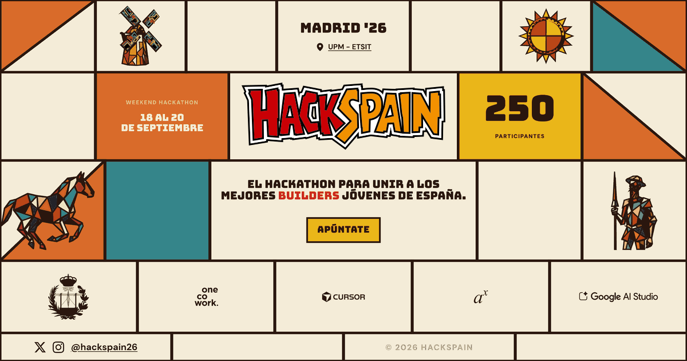
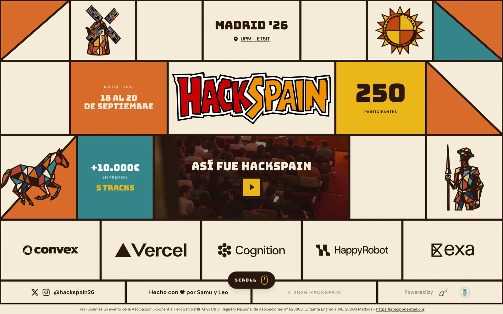
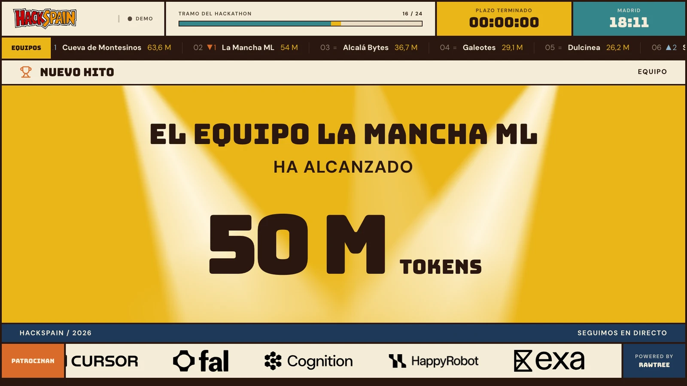
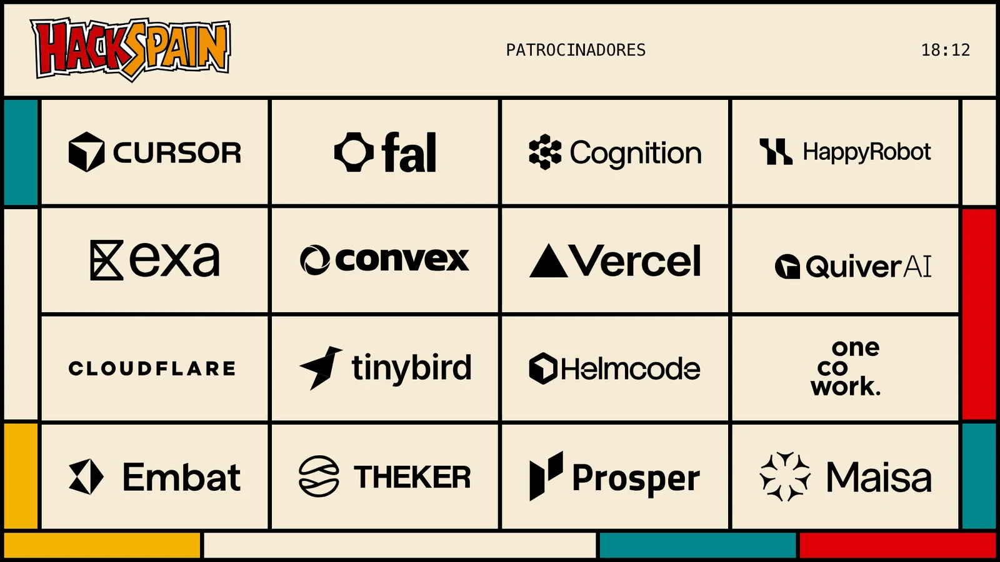
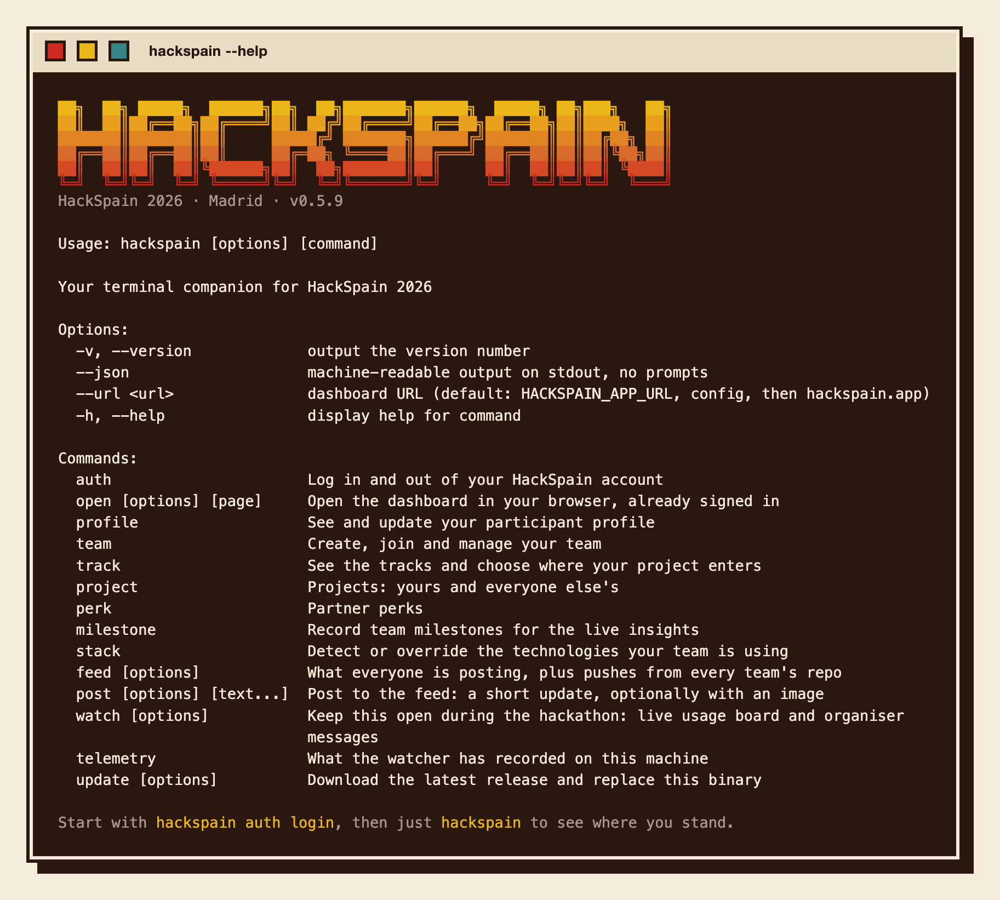
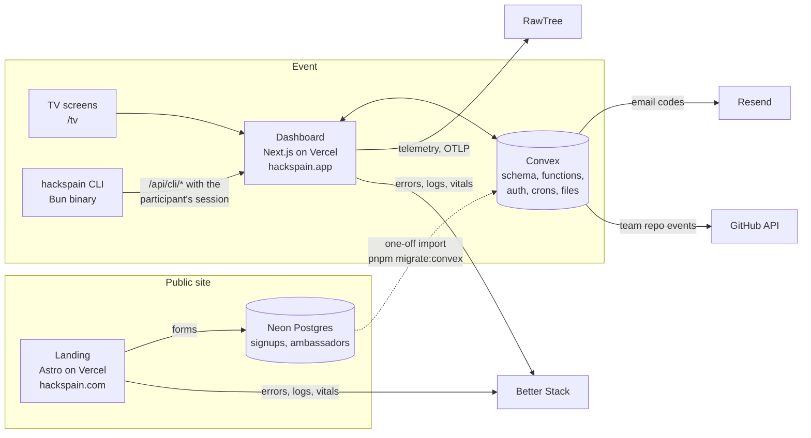
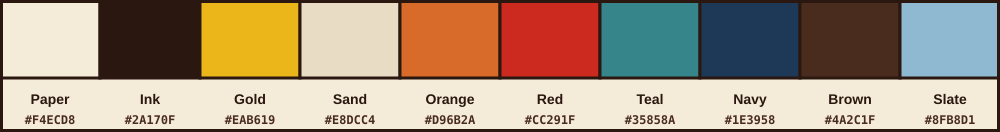

<p align="center">
  <a href="https://hackspain.com">
    <picture>
      <source media="(prefers-color-scheme: dark)" srcset="docs/readme/wordmark-white.svg">
      
    </picture>
  </a>
</p>

<p align="center">
  <strong>36 hours. 250 builders under 30. Madrid, 18 to 20 September 2026.</strong><br>
  The landing, the participant dashboard and the terminal client that ran HackSpain 2026.
</p>

<p align="center">
  <a href="https://hackspain.com">hackspain.com</a>
  &nbsp;·&nbsp;
  <a href="https://hackspain.app">hackspain.app</a>
  &nbsp;·&nbsp;
  <a href="https://x.com/hackspain26">X</a>
  &nbsp;·&nbsp;
  <a href="https://www.instagram.com/hackspain26/">Instagram</a>
  &nbsp;·&nbsp;
  <a href="mailto:contact@hackspain.com">contact@hackspain.com</a>
</p>

<p align="center">
  <a href="https://github.com/HackSpain/hackspain26/actions/workflows/ci.yml"></a>
  <a href="https://github.com/HackSpain/hackspain26/actions/workflows/cli-ci.yml"></a>
  <a href="https://github.com/HackSpain/hackspain26/releases"></a>
  <a href="LICENSE"></a>
</p>

<p align="center">
  <a href="https://hackspain.com"></a>
</p>

## What is HackSpain

HackSpain is an in-person hackathon for the best young technical talent in Spain. The 2026 edition took place at UPM-ETSIT in Madrid, from Friday 18 to Sunday 20 September 2026. Teams had 36 hours to build a project for one of five tracks set by Spanish startups. Every team got free compute and AI coding tools from the infrastructure sponsors. A jury of venture capital firms picked the winner of the grand prize.

| | |
| --- | --- |
| **When** | Friday 18 to Sunday 20 September 2026. 36 hours of building. |
| **Where** | UPM-ETSIT (Escuela Técnica Superior de Ingenieros de Telecomunicación), Madrid. |
| **Who** | 250 builders under 30, chosen from the applications. |
| **Tracks** | Five, set by Maisa, HappyRobot, Prosper AI, Embat and THEKER Robotics. |
| **Prizes** | A 5,000 € grand prize judged by JME Ventures, Kfund, Kibo Ventures, Enzo Ventures and Acurio Ventures. More than 10,000 € in prizes overall. |
| **Infrastructure** | Convex, Vercel, QuiverAI, Cloudflare, Tinybird, Cognition, Exa, fal.ai, Cursor and Helmcode. |
| **Organizer** | Asociación Exponential Fellowship. |
| **Language** | The event and the websites are in Spanish. The code and this documentation are in English. |

HackSpain 2026 is over. [hackspain.com](https://hackspain.com) now shows the recap video and the community's stories, and applications are closed for good. This repository is the code that ran the edition, published so that other student hackathons can reuse it.

## What is in this repository

One pnpm workspace with three apps, one for each surface the event had.

<table>
  <tr>
    <td align="center" width="33%">
      <br>
      <strong><a href="apps/web">apps/web</a></strong><br>
      The public landing at hackspain.com.<br>
      Astro 7, React islands, Tailwind v4, Neon Postgres with Drizzle.
    </td>
    <td align="center" width="33%">
      <br>
      <strong><a href="apps/app">apps/app</a></strong><br>
      The participant dashboard at hackspain.app.<br>
      Next.js 16, Convex, Convex Auth, shadcn.
    </td>
    <td align="center" width="33%">
      <br>
      <strong><a href="apps/cli">apps/cli</a></strong><br>
      The <code>hackspain</code> terminal client.<br>
      Bun, Commander and clack, compiled to one binary.
    </td>
  </tr>
</table>

### The landing

<p align="center">
  <a href="https://hackspain.com"></a>
</p>

The landing is a paper mosaic in Spanish. Before the event it took applications. Now it keeps the record of the edition.

- Pages for the mission, the tracks, the infrastructure, the grand prize, the mentors, the community recap, the brand kit, the ambassador programme, the code of conduct and the privacy policy.
- Signup and ambassador application forms wrote to Neon Postgres through Drizzle. Both closed when the event ended, and the API checks the date on the server, so no link can reopen them.
- Attendance confirmation for mentors and sponsors, a shareable participant badge with a generated Open Graph image, and an anonymous poll about AI coding tools.
- Two machine-readable pages: `/llms.txt` for language models and `/design.md`, the public design guide. Middleware serves the Markdown version of a page when a client asks for Markdown.
- Errors, logs and Web Vitals go to Better Stack through the Sentry-compatible SDK.

### The dashboard

<table>
  <tr>
    <td width="50%"><a href="https://hackspain.app/tv?view=panel&demo=1"></a></td>
    <td width="50%"><a href="https://hackspain.app/tv?view=patrocinadores&demo=1"></a></td>
  </tr>
  <tr>
    <td align="center"><sub>The TV panel, in demo mode with invented teams.</sub></td>
    <td align="center"><sub>The sponsors screen, one of twelve TV presets.</sub></td>
  </tr>
</table>

The dashboard is where accepted hackers lived during the weekend. Everything in it reads and writes Convex.

- **Access.** Sign in with an email code sent through Resend, and link a GitHub account if you want. An organizer accepts each application in `/admin` before the person can continue.
- **Onboarding.** Confirm your details, phone, diet and travel origin, upload a photo and get your participant card.
- **Teams and tracks.** Create a team, join with an 8-character code, link the team repository, transfer or dissolve the team, and register the project in one track.
- **Submission.** `/submit` takes the YouTube video, the public GitHub repository and an optional product URL. The tile is featured on the home page from Sunday 08:00 Madrid time.
- **Feed.** Short posts with images, reactions, comments and mentions. A Convex cron polls every team repository and posts pushes, pull requests, releases and tags into the same feed.
- **Insights.** A live view of AI usage per team and per tool, built from the telemetry the CLI uploads.
- **Participants map, perks and profiles.** Who is here, where they come from, and what the sponsors offer.
- **TV.** `/tv` drives the screens in the venue: twelve presets (waiting stripes, welcome on check-in, announcements, activity feed, sponsors, the live panel, the teams map, memes and a countdown) that organizers switch from `/admin/tv`. Add `&demo=1` to any preset to see it with invented data.
- **Judging and closing.** Separate flows for the jury and for sponsor judges, finalist selection, a reception check-in page and a closing page. These few paths skip the login on purpose.
- **CLI API.** The `/api/cli/*` routes expose an allowlist of Convex functions to the terminal client, authenticated with the participant's own session.

### The CLI

<p align="center">
  
</p>

`hackspain` is the dashboard for people who live in a terminal. Same account, same session, same data.

```sh
curl -fsSL https://hackspain.com/install.sh | sh   # macOS and Linux
hackspain auth login                                # approve from a signed-in dashboard tab, or use an email code
hackspain                                           # where you stand, then a menu
```

- Log in from the browser or with an email code. `hackspain open feed` signs your browser in from the CLI with a single-use token, so nobody types a second code.
- Manage your profile, team, tracks and milestones, read the feed and post to it. Pictures render inline in terminals that support the Kitty or iTerm2 image protocols.
- `hackspain watch` stays open all weekend. It shows your team, the AI tools it found, organizer announcements as desktop notifications, and the feed. Every 30 seconds it reads the local session logs of thirteen AI coding tools (Claude Code, Codex, Cursor, GitHub Copilot CLI, Gemini CLI, Qwen Code, OpenCode, Kilo Code, Cline, Pi, Oh My Pi, Antigravity and Devin), normalizes them to [one schema](apps/cli/docs/telemetry-schema.md) and uploads them for the insights and the TV.
- The telemetry is token counts, model names, session ids and a hash of the project folder. Prompts, responses, code, full paths, credentials and account ids never leave the machine. Recording only happens inside the event window that the organizers schedule.
- `--json` gives exactly one JSON object on stdout and no prompts. Release binaries check for updates and can replace themselves.

Everything else, from the login handoff to the exit codes, is in the [CLI README](apps/cli/README.md).

## How the pieces fit



Two boundaries matter when you change things:

- Public signup writes Neon. Dashboard data belongs in Convex. Moving anything across that line is a migration, not an endpoint edit.
- The CLI never talks to Convex directly. It calls the dashboard's `/api/cli/*` routes, which check the session and an allowlist of function names.

## Getting started

You need Node.js 22.12 or newer, pnpm 11 (`corepack enable` installs it) and [Bun](https://bun.sh). Bun runs the dashboard and CLI tests and compiles the CLI binaries.

```sh
pnpm install
cp apps/web/.env.example apps/web/.env
cp apps/app/.env.example apps/app/.env.local
```

**Landing.** `pnpm dev` starts it at [localhost:4321](http://localhost:4321). The static pages run without a database. The signup and ambassador APIs need `DATABASE_URL` (Neon Postgres).

**Dashboard.** It needs a Convex development deployment. Run `pnpm dev:convex` in one terminal and `pnpm dev:app` in another, or `pnpm dev:all` for the landing, the dashboard and Convex together. The dashboard is at [localhost:3000](http://localhost:3000). Auth and admin setup is [below](#convex-auth-admin-and-data).

**CLI.** `pnpm dev:cli -- --help` runs it from source against `localhost:3000`. With a dev deployment that has `ALLOW_EMAIL_OTP_STUB=true`, sign in with `pnpm dev:cli -- auth login --email you@example.com --code 00000000`.

Do not run `convex deploy` for local validation. Production Convex deploys only through the dashboard's Vercel build, and a deploy from a laptop replaces it. See [Deploy](#deploy).

### Commands

| Command | Description |
| :------ | :---------- |
| `pnpm dev` / `pnpm dev:web` | Landing only |
| `pnpm dev:app` | Dashboard Next.js server |
| `pnpm dev:convex` | Convex functions and codegen (development only) |
| `pnpm dev:all` | Landing, dashboard and Convex in one terminal |
| `pnpm build` / `pnpm build:app` | Production builds |
| `pnpm preview` | Preview the landing build |
| `pnpm check` | Astro and TypeScript checks for the landing |
| `pnpm lint` / `pnpm fix` | Check or fix the monorepo with Oxlint and Ultracite |
| `pnpm test:app` / `pnpm test:cli` | Dashboard and CLI unit tests (Bun) |
| `pnpm dev:cli -- <args>` / `pnpm build:cli` | Run the CLI from source, or compile the binaries |
| `pnpm migrate:convex` | Import Neon signups and ambassadors into Convex |
| `pnpm --filter app backfill:avatars` | Create the 128 px thumbnails for photos uploaded before the map existed |
| `pnpm db:generate` / `pnpm db:migrate` / `pnpm db:push` | Landing Drizzle migrations |

## Convex: auth, admin and data

1. From the repo root, run `pnpm dev:convex`. Create or select a **dev** project and leave it running.
2. Set the Convex environment from `apps/app` in another terminal:

```sh
pnpm exec convex env set SITE_URL http://localhost:3000
pnpm exec convex env set ADMIN_EMAILS you@example.com
pnpm exec convex env set MIGRATION_SECRET "$(openssl rand -hex 24)"
# Email delivery. Without a key, sign-in refuses to send codes unless the stub below is on.
pnpm exec convex env set RESEND_API_KEY re_...
pnpm exec convex env set RESEND_FROM "HackSpain <onboarding@resend.dev>"
# Dev only: 00000000 also works as the email sign-in code (ignored when RESEND_API_KEY is set).
pnpm exec convex env set ALLOW_EMAIL_OTP_STUB true
# GitHub account linking (optional). The callback goes directly to the Convex
# HTTP action at <CONVEX_SITE_URL>/github/callback.
pnpm exec convex env set GITHUB_CLIENT_ID Iv1...
pnpm exec convex env set GITHUB_CLIENT_SECRET ...
# Feed polling of team repositories. A token with public read access lifts the rate limit.
pnpm exec convex env set GITHUB_TOKEN ghp_...
```

`AUTH_RESEND_KEY` and `AUTH_EMAIL` still work as fallbacks for the two Resend variables.

3. Copy the printed `CONVEX_URL` into `apps/app/.env.local` as `NEXT_PUBLIC_CONVEX_URL`.
4. Generate the Convex Auth JWT keys once, from `apps/app`: `pnpm dlx @convex-dev/auth`.
5. Sign in at `/login` with an email that exists in the Convex `signups` table. An organizer must mark that signup **accepted** in `/admin` before the person can confirm details.

Accepted hackers give a contact phone (E.164, stored as typed and never verified), confirm terms and notification consent, dietary restrictions, travel origin, and attend or cancel.

### Importing Neon into Convex

`pnpm migrate:convex` from the repo root upserts the landing's signups and ambassador applications into Convex. It is idempotent on email and safe to re-run, but it imports real data, so run it only when you mean to.

It loads `DATABASE_URL` from `apps/web/.env`, and `NEXT_PUBLIC_CONVEX_URL` plus `MIGRATION_SECRET` from `apps/app/.env.local`. Shell exports win if already set. `MIGRATION_SECRET` must match the Convex deployment. Rows with `approval_status = confirmed` are marked accepted. Re-runs do not clear an admin's accepted flag.

### Profile photo thumbnails

The participants map draws every photo at 128 px. New uploads make that copy in the browser. Pictures uploaded before that are resized on every request until you run `pnpm --filter app backfill:avatars` once, with the same environment as the import. People who already have a thumbnail are skipped.

## Design

<p align="center">
  
</p>

HackSpain looks like a paper mosaic: flat tiles separated by thick ink lines, hard offset shadows, no gradients, no gray, no dark mode. Bungee sets the headlines and buttons, DM Sans in heavy weights sets everything else. The motifs come from La Mancha and are drawn as ink brush illustrations with a cubist colour treatment.

The full guide is [`apps/web/src/data/design.md`](apps/web/src/data/design.md), served at [hackspain.com/design.md](https://hackspain.com/design.md). Read it before you touch any UI. The logos and the brand kit are at [hackspain.com/brand](https://hackspain.com/brand).

The tokens are defined in three places that must stay in sync: `apps/web/src/styles/global.css`, `apps/web/src/components/theme/palette.ts` and `apps/app/src/app/globals.css`, where the dashboard maps them to shadcn variables.

## Deploy


Two Vercel projects, both linked to this repository. Set **Root Directory** before the first production deploy of the monorepo, or the landing build will look for Astro at the repo root and fail.

| Project | Root Directory | Domain | Build |
| --- | --- | --- | --- |
| Landing | `apps/web` | hackspain.com | `pnpm run build` |
| Dashboard | `apps/app` | hackspain.app | `pnpm run vercel-build`, which deploys Convex and then builds Next.js |

Vercel reads `pnpm-lock.yaml` and `pnpm-workspace.yaml` from the repo root (`installCommand` is `cd ../.. && pnpm install --frozen-lockfile`). A change that only touches the other app is skipped by `scripts/vercel-ignore.sh`. When the last deployed commit is outside Vercel's shallow clone, the script fetches it, and builds if it cannot.

### Convex on merge

The dashboard build runs `convex deploy --cmd 'pnpm run build'`. That needs `CONVEX_DEPLOY_KEY` in Vercel, not a local `pnpm exec convex deploy`.

1. In the Convex dashboard, create a **production** deployment for the project if there is none.
2. Production deployment, Settings, Deploy Keys: **Generate Production Deploy Key** (`deployment:deploy`).
3. In the Vercel project's Environment Variables, set `CONVEX_DEPLOY_KEY` to that key for **Production** only. Optionally add a **Preview** deploy key as `CONVEX_DEPLOY_KEY` for Preview, which gives each pull request its own Convex backend.
4. On the Convex **production** deployment, set the environment (from `apps/app` with `pnpm exec convex env set`, or in the dashboard UI):

```sh
pnpm exec convex env set SITE_URL https://hackspain.app
pnpm exec convex env set ADMIN_EMAILS you@example.com
pnpm exec convex env set RESEND_API_KEY re_...
pnpm exec convex env set RESEND_FROM "HackSpain <noreply@updates.hackspain.com>"
pnpm exec convex env set MIGRATION_SECRET "$(openssl rand -hex 24)"
pnpm exec convex env set GITHUB_CLIENT_ID ...
pnpm exec convex env set GITHUB_CLIENT_SECRET ...
pnpm exec convex env set GITHUB_TOKEN ...
```

5. In the production deployment's settings, add and verify `api.hackspain.com` as a custom domain, then make it the default HTTP Actions domain by overriding `CONVEX_SITE_URL`.
6. Set the production GitHub OAuth App callback URL to `https://api.hackspain.com/github/callback`. GitHub calls the Convex HTTP action directly. After linking, Convex sends the browser back to the dashboard URL in `SITE_URL`.

Do **not** set `ALLOW_EMAIL_OTP_STUB` on production. Do **not** commit `.env` or `.env.local`.

`convex deploy --cmd` injects `NEXT_PUBLIC_CONVEX_URL` into the Next.js build, so you do not paste the production Convex URL into Vercel unless you skip the deploy-key flow. The landing's Vercel environment (`DATABASE_URL`, `RESEND_*`, `BETTER_STACK_*`, `RAWTREE_*`) is separate and has nothing to do with Convex.

Never deploy a branch to production by hand. Its functions vanish on the next Vercel build, and rows it created can block the next schema push.

## CI and releases

Three GitHub Actions workflows run on pull requests:

- `ci.yml` typechecks, tests and builds the dashboard, and builds the landing. Lint and `astro check` report but do not block until [#235](https://github.com/HackSpain/hackspain26/issues/235) and [#236](https://github.com/HackSpain/hackspain26/issues/236) land.
- `cli-ci.yml` typechecks, lints, tests and compiles the CLI on every change to `apps/cli` or the Convex functions.
- `cli-release.yml` cross-compiles the CLI for macOS, Linux and Windows, writes `SHA256SUMS` and publishes a GitHub release when a `cli-vX.Y.Z` tag is pushed. `install.sh` and `hackspain update` read that release.

To release the CLI, bump `apps/cli/package.json`, tag `master` with the matching `cli-vX.Y.Z` and push the tag.

## Repository layout

```
apps/
  web/                 Astro landing (hackspain.com)
    src/data/          event data, SEO copy, llms.txt and design.md
    src/components/    sections, forms, theme tokens
  app/                 Next.js dashboard (hackspain.app)
    convex/            schema, functions, crons, HTTP actions, auth
    src/app/           routes: feed, teams, tracks, submit, tv, admin, api/cli
  cli/                 Bun CLI, compiled to the hackspain binary
    docs/              telemetry schema contract
docs/
  learnings.md         dated, verified lessons from building this
  readme/              images used by this README
scripts/vercel-ignore.sh   skips Vercel builds that do not touch the app
AGENTS.md              constraints and traps for contributors and coding agents
THIRD_PARTY_NOTICES.md what the MIT license does not cover
```

## Documentation

- [AGENTS.md](AGENTS.md): the project traps that are hard to infer from code. Read it before you change auth wrappers, Convex deploys, telemetry or public paths.
- [docs/learnings.md](docs/learnings.md): dated findings with evidence and prevention steps. Check the entries for an area before working in it.
- [apps/cli/README.md](apps/cli/README.md): every command, the login handoff, the watcher, the release process and the exit codes.
- [apps/cli/docs/telemetry-schema.md](apps/cli/docs/telemetry-schema.md): the telemetry contract. Consumers deduplicate forever by participant and event id.
- [apps/web/src/data/design.md](apps/web/src/data/design.md): the design guide, also at [hackspain.com/design.md](https://hackspain.com/design.md).
- [apps/web/src/data/llms.txt](apps/web/src/data/llms.txt): the summary served to language models. It must follow visible copy changes.

## Contributing

Issues and pull requests are welcome. Before you open one:

1. Read [AGENTS.md](AGENTS.md) and the [learnings](docs/learnings.md) for the area you touch.
2. Run `pnpm lint`, `pnpm check`, `pnpm test:app` and `pnpm test:cli`.
3. Keep the design tokens, `llms.txt` and the telemetry schema in sync with your change when it affects them.
4. Never run `convex deploy` against production from your machine.

Changes reach `master` through pull requests. Release binaries only come from tags.

## Credits

HackSpain 2026 was organized by Asociación Exponential Fellowship with the help of the sponsors, the track startups, the jury, the mentors and UPM-ETSIT. This code was written by the organizing team and volunteers. See the [contributors](https://github.com/HackSpain/hackspain26/graphs/contributors).

The chart components in the insights pages are adapted from [Amicro Mono Charts](https://github.com/Subhan-code/Amicro--Micro-transitions-) by Syed Subhan Uddin (MIT).

## License

The code is released under the [MIT License](LICENSE), copyright 2026 Asociación Exponential Fellowship.

The HackSpain name, logos and brand kit, the Quixote illustrations, the recap video, the photos of judges, mentors and participants, and the sponsor and tool logos are not covered by that license. They belong to their owners and appear here only because the sites need them. [THIRD_PARTY_NOTICES.md](THIRD_PARTY_NOTICES.md) lists every path.
