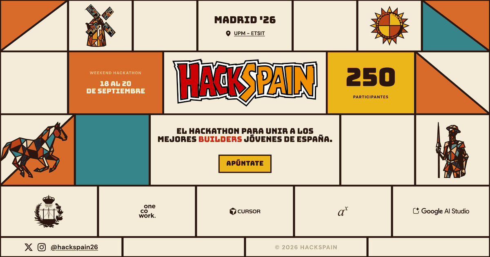
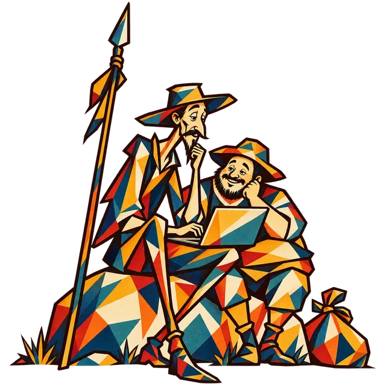
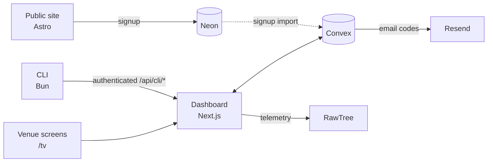

<p align="center">
  <a href="https://hackspain.com">
    <picture>
      <source media="(prefers-color-scheme: dark)" srcset="docs/readme/wordmark-white.svg">
      
    </picture>
  </a>
</p>

<p align="center">
  <strong>36 hours. 250 builders under 30. Madrid, 18 to 20 September 2026.</strong><br>
  The landing, the participant dashboard and the terminal client that ran HackSpain 2026.
</p>

<p align="center">
  <a href="https://hackspain.com">hackspain.com</a>
  &nbsp;·&nbsp;
  <a href="https://hackspain.app">hackspain.app</a>
  &nbsp;·&nbsp;
  <a href="https://x.com/hackspain26">X</a>
  &nbsp;·&nbsp;
  <a href="https://www.instagram.com/hackspain26/">Instagram</a>
  &nbsp;·&nbsp;
  <a href="mailto:contact@hackspain.com">contact@hackspain.com</a>
</p>

<p align="center">
  <a href="https://github.com/HackSpain/hackspain26/actions/workflows/ci.yml"></a>
  <a href="https://github.com/HackSpain/hackspain26/actions/workflows/cli-ci.yml"></a>
  <a href="https://github.com/HackSpain/hackspain26/releases"></a>
  <a href="LICENSE"></a>
</p>

<p align="center">
  <a href="https://hackspain.com"></a>
</p>

## What is HackSpain?

HackSpain was an in-person hackathon for 250 selected builders under 30. The 2026 edition took place at UPM-ETSIT in Madrid from 18 to 20 September. Teams had 36 hours to build a project for one of five tracks set by Maisa, HappyRobot, Prosper AI, Embat and THEKER Robotics.

Infrastructure sponsors provided compute and AI coding tools. A venture capital jury chose the winner of the €5,000 grand prize; the event offered more than €10,000 in prizes overall. It was organized by Asociación Exponential Fellowship.

The event is over. This repository contains the public site, participant dashboard and terminal client that ran the 2026 edition, published for other hackathons to reuse.

## Apps

| | App | Purpose |
| --- | --- | --- |
|  | [`apps/web`](apps/web) · Astro, Neon, Drizzle | Public site and signup |
|  | [`apps/app`](apps/app) · Next.js, Convex | Participant dashboard, admin and venue screens |
|  | [`apps/cli`](apps/cli) · Bun | Participant terminal client |

Public signup writes to Neon. Dashboard data lives in Convex. The CLI reaches Convex through authenticated dashboard `/api/cli/*` routes.


```mermaid
flowchart LR
  Landing["Public site<br/>Astro"] -->|signup| Neon[(Neon)]
  Neon -.->|signup import| Convex[(Convex)]
  Dashboard["Dashboard<br/>Next.js"] <--> Convex
  CLI["CLI<br/>Bun"] -->|"authenticated /api/cli/*"| Dashboard
  TV["Venue screens<br/>/tv"] --> Dashboard
  Convex -->|email codes| Resend[Resend]
  Dashboard -->|telemetry| RawTree[RawTree]
```

## Development

Requires Node.js 22.12+, pnpm 11 and Bun.

```sh
pnpm install
pnpm dev        # public site
pnpm dev:all    # public site, dashboard and Convex
```

See [`package.json`](package.json) for the other scripts and the [CLI README](apps/cli/README.md) for CLI usage and releases.

## Deploy


The public site and dashboard run as separate Vercel projects. The dashboard's Vercel build also deploys Convex. Do not deploy a branch to production by hand: the next build replaces its functions, and incompatible rows can block the schema push.

## Project docs

- [AGENTS.md](AGENTS.md): project constraints and deployment traps.
- [apps/cli/docs/telemetry-schema.md](apps/cli/docs/telemetry-schema.md): CLI telemetry contract.
- [apps/web/src/data/design.md](apps/web/src/data/design.md): design guide; read before changing UI.

## License

Code is [MIT licensed](LICENSE). The name, logos, illustrations, photos, video and third party marks are excluded; see [THIRD_PARTY_NOTICES.md](THIRD_PARTY_NOTICES.md).
